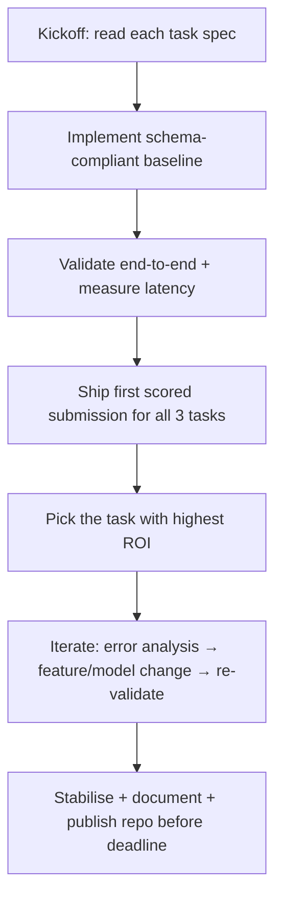

# Competitive Applied AI Tasks for NM i AI: a three-task championship field guide

## Executive summary

NM i AI 2026 is explicitly structured as **three independent challenges** run in parallel, with **real-time automated scoring** and an overall leaderboard computed by **normalising each task to a 0–100 scale (relative to the best team on that task) and averaging across the three tasks**. Skipping a task yields a normalised score of 0 for that task, so “getting on the board” in all three is structurally important even if one solution is crude. citeturn1view0

The key practical implication of that scoring rule is that your **first goal is three working baselines** (one per task) that satisfy the **submission protocol + latency/compute limits + schema**, then you iterate. This is also consistent with how the platform historically ran NM i AI 2025: each task was a separate use case with a defined endpoint and a validation/evaluation pipeline, and teams commonly operated three separate services. citeturn9view0turn10view0

Tasks and documentation for 2026 are published at kickoff (the platform indicates **tasks/docs open around 18:15 CET on March 19, 2026**, while the rules list **competition start at 18:00 CET**), so you should assume you’ll need to absorb requirements quickly and make early architectural decisions under time pressure. citeturn1view0turn2view0turn2view1

For immediate “what to expect” breadth: the 2025 edition’s three tasks covered (i) **agent control / RL-like decision-making** (race car), (ii) **medical image segmentation** (tumour masks from PET-derived images), and (iii) **NLP/RAG-style statement verification + topic classification** under offline/latency constraints. That mix is a good prior for the *style* of challenges (heterogeneous modalities + real-ish deployment constraints), even though the 2026 task content is unpublished until kickoff. citeturn15view1turn15view0turn14view0turn1view0

A final operational point that affects how you code today: prize eligibility requires identity verification via entity["company","Vipps","norwegian payments app"] and publishing your code in a public repository under the MIT (or equivalent permissive) license by the deadline, and organisers may verify work via code review and anti-collusion checks. Treat “clean repo + reproducible runbook” as part of the deliverable, not a postscript. citeturn1view0

## NM i AI competition mechanics that shape strategy

**Time window and parallelism.** NM i AI 2026 runs for ~69 hours (start Thu March 19, 2026; deadline Sun March 22, 2026), with three tasks available concurrently and no requirement to participate in all tasks—except the scoring makes that highly advantageous. citeturn1view0

**Overall scoring is relative and equal-weighted.** Each task score is normalised to 0–100 by dividing by the best team’s score on that task, then the overall score is a simple average across the three tasks; missing submissions count as 0 for that task. citeturn1view0  
First-principles interpretation: the normalisation converts “raw metric units” (Dice, accuracy, distance, etc.) into an across-task comparable scale that rewards being close to the best *in each task*, not maximising one at the expense of another.

**Tooling freedom with strict fairness.** The rules explicitly allow AI coding assistants and public models/libraries/datasets/papers, while strictly prohibiting cross-team solution sharing and platform abuse. citeturn1view0  
Practical consequence: you can move fast with assistants and open-source components, but you must keep your work isolated and document provenance in your repo.

**Deployment and reproducibility pressure.** Teams bring their own compute and infra; the organisers do not provide environments beyond the platform. citeturn1view0 Prize eligibility requires a public code repository (MIT or equivalent) submitted before the deadline. citeturn1view0  
Practical consequence: favour approaches with low operational risk—small number of moving parts, deterministic inference, logged versions, and quick rollback.

**Task release timing.** The platform shows tasks and documentation “open at kickoff” and displays the reveal time around **18:15 CET** on March 19. citeturn2view0turn2view1 The rules schedule the kickoff/start at **18:00 CET**. citeturn1view0  
Practical consequence: plan a “first 60–90 minutes” routine that assumes incomplete info until docs fully appear.

**Warm-up evidence about interaction formats.** The pre-competition entity["sports_event","Grocery Bot Challenge","nm i ai warm-up"] used a WebSocket-connected agent controlling multiple bots in a gridworld, with rate limits and strict wall-clock time per game. citeturn1view0turn1view4  
Practical consequence: NM i AI is comfortable with *interactive agent evaluation*, not only file-based submissions.

A minimal strategy workflow that fits these mechanics:



This pattern matches how the 2025 platform encouraged teams to work: each task had a validate/evaluate queue and a single final evaluation attempt (in that season), so teams rehearsed validation and treated evaluation as a release. citeturn11view2turn14view0turn15view0turn15view1

## The competitive task landscape you should be ready for

What follows is a practical map of **task categories that commonly appear in three-task applied AI championships**, anchored to (a) what NM i AI has already run, and (b) what comparable competition ecosystems run on entity["company","Kaggle","data science platform"], entity["organization","NeurIPS","machine learning conference"] competition tracks, entity["company","AIcrowd","competition platform"], and challenge platforms like entity["organization","Codabench","benchmarking platform"] / entity["organization","CodaLab","competition platform"]. citeturn1view0turn22view4turn22view1turn21search17

### Task families and what “input → output” usually looks like

| Task family (what it really is) | Typical input format | Typical output format | Typical metric | What usually wins early |
|---|---|---|---|---|
| Supervised learning (tabular) | `train.csv`, `test.csv`, mixed numeric/categorical, missingness | `submission.csv` with `id,pred` | RMSE/RMSLE, MAE, AUC, logloss | Gradient-boosted trees + solid CV + leakage checks (common outcome in applied forecasting contests). citeturn19search0turn22view9 |
| Time series forecasting | Historical series + exogenous weather/events; often many series | Horizon forecasts per series/timestep | MAE/RMSE variants; sometimes hierarchical metrics | Lag features + tree models, then add regime features and calibration/uncertainty. citeturn22view9turn22view8 |
| NLP classification | Text statements, metadata, label taxonomy | Class ID(s), probability(s), sometimes rationale | Accuracy/F1/AUC | Strong baseline = TF–IDF + linear model; then small transformer finetune if compute allows. (NM i AI 2025 used accuracy for binary + multi-class topic ID). citeturn14view0 |
| RAG / retrieval + verification | Query/statement + reference corpus | Label(s) (true/false, topic), optionally evidence IDs | Often accuracy; sometimes retrieval nDCG / faithfulness | Hybrid retrieval (BM25 + embeddings if allowed) + constrained generator; aggressively measure latency/offline compliance. citeturn14view0turn9view0 |
| Computer vision classification/detection | Images (files or base64), sometimes video frames | Label / boxes / polygons | Accuracy, mAP, IoU variants | Finetune pretrained vision backbone; heavy augmentation is a quick gain if evaluation matches. |
| Segmentation (medical/industrial) | Image(s) (2D/3D slices, base64, arrays) | Mask image (binary or multi-class), same resolution | Dice/IoU | Get a valid mask pipeline first; then U-Net-style or nnU-Net-style training, plus post-processing. (NM i AI 2025 used Dice and required an RGB black/white mask). citeturn15view0 |
| RL / agent control (interactive) | State vectors, sensors, partial observability; streamed | Action(s) per step; sometimes batched | Episode reward / distance / win rate; sometimes TrueSkill ladder | Strong rule-based policy beats unstable RL early; then imitation/RL fine-tuning once the interface is stable. (NeurIPS Lux AI uses TrueSkill; NM i AI 2025 car used distance). citeturn15view1turn22view1turn22view2 |
| Optimisation / scheduling | Graphs, costs, constraints; large combinatorial space | Feasible plan/route/assignment | Objective score; feasibility penalties | Heuristics + local search + constraint programming where possible; focus on feasibility first. (ICPC routing challenge frames NP-hard routing with resource limits). citeturn22view7 |
| MLOps / deployment as a task constraint | Implicit in all above if judged via API | Must serve within latency/memory; robust errors | Often hidden, but failures = disqualification/0 | Minimal-dependency service, version pinning, health checks, graceful degradation. (NM i AI emphasises automated evaluation + code verification; 2025 tasks had strict per-request latency). citeturn1view0turn14view0turn15view0 |
| Prompt engineering / few-shot | Task is to elicit structured outputs under constraints | JSON schema outputs, tool calls, short answers | Exact-match / rubric / judge model | Start with strict schemas + self-checking prompts; lock temperature and add refusal/guardrails if needed. (Often appears when “deployment realism” is a goal; NM i AI permits AI assistants and public models, so LLM-centred tasks are plausible). citeturn1view0 |

Two meta-patterns to carry into kickoff:

1. **Many “applied AI” competitions are secretly “interfaces + constraints” competitions.** A model that’s 5% worse but always returns correctly formatted output under latency limits beats a fragile SOTA attempt. This is explicit in NM i AI’s automated scoring + verification framing and in previous offline/latency-bound tasks. citeturn1view0turn14view0turn15view0  
2. **Synthetic data and distribution shift are common.** NM i AI 2025’s healthcare statements were generated from reference materials (synthetic text), and evaluation emphasised accuracy under strict time/privacy constraints. citeturn14view0

## Concrete examples that NM i AI has used before

The best way to anticipate NM i AI 2026 is to understand how NM i AI 2025 specified tasks. The 2025 season published three “use cases” on an evaluation server and provided starter repositories with clear constraints and scoring. citeturn10view0turn15view1turn15view0turn14view0

### Emergency Healthcare RAG (NLP + retrieval + classification under constraints)

**Problem statement (what you had to do).** Given a medical statement, predict (i) whether it is true/false and (ii) which topic it belongs to (115 topics). citeturn14view0

**Data and generation details (why this mattered).** The dataset comprised statements generated by a model (Claude Opus) based on reference articles across 115 topics, with defined train/validation/evaluation sizes (200/200/749). citeturn14view0  
First-principles implication: because text was generated from a *finite reference corpus*, retrieval methods that map statement ↔ topic-reference text can be disproportionately effective versus generic “world knowledge” modelling.

**Constraints (the real difficulty).** Inference had to be offline (no cloud API calls), under 5 seconds per statement, and within a 24GB VRAM ceiling. citeturn14view0

**Evaluation metric and how it was computed.** Scoring used accuracy for both the binary and the multi-class predictions. citeturn14view0  
From first principles: accuracy rewards correct top-1 decisions; if class imbalance exists, accuracy can hide failure on rare classes—so you typically monitor per-topic confusion locally even if the official score is accuracy.

**Submission interface.** The task was served via an HTTP endpoint (e.g., `POST /predict`) returning a JSON payload like `{ "statement_is_true": 1, "statement_topic": 63 }`. citeturn14view0turn9view0

### Tumour Segmentation (computer vision segmentation, medical imaging)

**Problem statement.** Segment tumour regions in “Whole-body MIP-PET” images; you received labelled patient images plus additional healthy controls. citeturn15view0

**Why MIP-PET specifically changes modelling.** The challenge used maximum-intensity projection of PET volumes (reduce 3D to 2D via max along an axis), which concentrates high-uptake regions and makes some organs (brain, bladder, kidneys, heart, liver) consistently bright even without cancer. citeturn15view0  
First-principles implication: naïve thresholding will over-segment physiologically bright organs; you need either learned context or rule-based organ suppression.

**Required output format.** Return an RGB image mask with only white `(255,255,255)` and black `(0,0,0)` pixels, same shape as the input. citeturn15view0

**Latency constraint.** You had 10 seconds to return a prediction per image. citeturn15view0

**Metric.** Dice–Sørensen coefficient in \[0,1\] with an explicit TP/FP/FN formulation. citeturn15view0  
From first principles: Dice emphasises overlap; false negatives and false positives both hurt, and very small tumours can dominate instability—post-processing (connected components, size thresholds) often produces immediate gains.

**Baseline provided.** A simple threshold baseline was included as a starter, demonstrating a valid mask pipeline. citeturn15view0  
Practical lesson: “valid-format baseline first” is an intended workflow, not an afterthought.

### Race Car Control (agent control with sensors)

**Problem statement.** Control a car to travel as far as possible in one minute while avoiding crashes with other cars and walls. citeturn15view1

**Environment dynamics.** The game runs at 60 ticks per second for up to 60 seconds; other cars spawn in lanes with varying relative speeds; collision ends the episode. citeturn15view1

**Observations and actions.** The car has multiple range sensors (the spec describes sensor angles/names and a 1000px reach) and expects discrete actions such as `ACCELERATE`, `STEER_LEFT`, etc.; the server requests actions and recommends sending a *batch* of future actions to reduce network delays. citeturn15view1

**Scoring.** Distance travelled; scores were normalised with the lowest receiving 0 and highest 1, and only performance above a baseline counted (below-baseline forced to 0). citeturn15view1  
First-principles implication: risk-sensitive control matters. A conservative policy that rarely crashes may outperform an aggressive policy with occasional catastrophic failures because the episode ends on crash.

### What these examples imply about NM i AI 2026

Even without knowing 2026’s tasks before kickoff, the 2025 design shows NM i AI’s preference for:

- **Heterogeneous modalities** (text + images + interactive control). citeturn10view0turn15view0turn15view1  
- **Realistic constraints** (offline inference, per-request latency). citeturn14view0turn15view0  
- **Service-style submissions** (endpoint-based evaluation scripts and validation queues were central in 2025 team tooling). citeturn9view0turn11view2  

## Metrics, baselines, quick wins, and time allocation by task type

### Metric cheat-sheet from first principles

**A metric is a single number the organiser uses to rank solutions.** Competitions often hide test labels, so your job is to maximise expected test performance under that metric, not to build a “general good model”.

- **Accuracy**: fraction correct. Works when classes balanced and predictions are crisp. Used in the 2025 healthcare RAG task for both binary truth and topic ID. citeturn14view0  
- **Dice (segmentation)**: overlap between predicted mask and ground truth; equals 1 only for perfect overlap. Used for tumour segmentation. citeturn15view0  
- **Episode score / distance / reward (agents)**: cumulative objective over an episode; high variance and crash termination means you must manage tail risk. Used for race car. citeturn15view1  
- **RMSE/RMSLE (tabular regression)**: penalises large errors; Kaggle-style house pricing competitions often evaluate RMSE on log targets (equivalent to RMSLE). citeturn19search0  
- **Hierarchical forecasting metrics**: competitions like M5 define very specific submission formats and evaluation setups. The M5 data page emphasises `sample_submission.csv` correctness and time-indexed columns, reflecting that “format adherence” is part of the challenge. citeturn19search1  

### Practical baseline and “quick-win” playbook

The table below is tuned for a 69-hour, three-task setting where interface mistakes are costly and tasks are heterogeneous (as in NM i AI 2025 and as implied by NM i AI 2026’s parallel-task structure). citeturn1view0turn10view0

| Task type | Baseline you can ship fast | Quick wins that usually pay off | Common traps |
|---|---|---|---|
| Tabular supervised | CatBoost/LightGBM with simple preprocessing + CV | Handle missingness + categorical encoding correctly; remove leakage; target transforms for log-metrics | Overfitting public leaderboard; time wasted on exotic models when features dominate |
| Time series | Lag features + tree model; naive seasonal baseline as sanity check | Time features + holiday/regime; rolling stats; uncertainty estimates if metric rewards it (WindAI judged beyond accuracy). citeturn22view9 | Leakage via future covariates; wrong CV split (random CV on time series) |
| NLP classification | TF–IDF + linear model | Label smoothing / calibration; better tokenisation; simple ensembling | “LLM everywhere” without measuring latency; ignoring class taxonomy details |
| RAG / verification | BM25 retrieval back to reference corpus + constrained classifier | Hybrid retrieval; caching; quantisation; strict schema validation; topic priors | Hallucinating evidence; slow generation; violating offline constraint (explicitly disallowed in 2025 healthcare). citeturn14view0 |
| CV classification | Pretrained model finetune | Strong augmentations; proper resolution; class-balanced sampling | Training too long without a metric loop; mismatch between train augmentations and test reality |
| Segmentation | Valid mask pipeline + simple threshold or small U-Net | Post-processing (remove tiny blobs); loss tuning for Dice; organ suppression heuristics for PET-like brightness (explicit confounders listed). citeturn15view0 | Invalid mask format; wrong image orientation; silent resizing that misaligns labels |
| Agent control (RL-ish) | Rule-based controller using sensors + safety margins | Batch actions (reduces network pain); curriculum (train on easy seeds first); imitation learning from heuristic policy | RL training before the interface is stable; ignoring crash tail risk (episode ends). citeturn15view1 |
| Optimisation | Feasible greedy + local improvement | Penalty handling; caching; domain-specific heuristics | Building an infeasible “clever” method; ignoring objective scaling (can make heuristics unstable) |

### Time allocation that fits NM i AI’s scoring rule

Because NM i AI normalises and averages task scores, your time allocation should initially prioritise **coverage** (three non-zero submissions), then **marginal gains** where you have comparative advantage. citeturn1view0

A practical allocation template (adjust if a task is clearly “toy” vs “deep”):

| Phase | Target outcome | Suggested time slice (of 69h) | Why it works under normalised averaging |
|---|---|---:|---|
| Baseline sprint | 3 schema-valid baselines on leaderboard | ~10–15% | Converts potential 0s into >0 and surfaces hidden constraints early. citeturn1view0turn15view0 |
| Interface hardening | Latency + robustness + logging | ~10% | Prevents “evaluation day meltdown”; NM i AI uses automated scoring and verification. citeturn1view0turn14view0 |
| Main optimisation loop | Improve the most “movable” task | ~55–65% | Normalised scoring rewards closing the gap to the best; pick the task where gap shrinks fastest. citeturn1view0turn22view9 |
| Freeze and package | Reproducible repo + final submissions | ~10–15% | Prize eligibility and code review require a clean public repo (MIT or equivalent). citeturn1view0 |

## Competition-day toolkit, templates, and pitfalls

### Essential tools and libraries

Treat tooling as a way to reduce *time-to-working-baseline* and *risk of interface failure*.

- **Python environment + version pinning**: the 2025 top-team repo illustrates isolating dependencies per task and using an API wrapper pattern (one service per task) to match evaluation endpoints. citeturn9view0  
- **Service framework**: lightweight HTTP services (e.g., FastAPI-style) are a natural fit when tasks are judged by calling your `/predict` endpoint, as in 2025. citeturn9view0turn14view0  
- **Observability**: logs + timing per request. The 2025 healthcare task made latency a hard constraint (5 seconds), which makes per-request profiling non-optional. citeturn14view0  
- **Compute planning**: if a task is offline + VRAM-bounded, you need quantisation/caching options ready (explicitly mentioned as performance factors in the healthcare task guidance). citeturn14view0  
- **Benchmark infrastructure familiarity**: platforms like Codabench/CodaLab illustrate the general pattern—task definitions include data + metric + an evaluation program that produces a numeric score on a leaderboard. That’s the mental model you should assume even if NM i AI uses its own platform. citeturn22view4  

### Lightweight code templates/snippets

These are “glue” templates—deliberately minimal—because NM i AI tasks may be endpoint-based, file-based, or interactive.

**Template A: safe prediction wrapper (schema + timing + fallback)**

```python
import time
import traceback

def safe_predict(predict_fn, x, max_seconds: float):
    t0 = time.time()
    try:
        y = predict_fn(x)
    except Exception:
        # Never crash the service; return a conservative default.
        traceback.print_exc()
        y = None
    dt = time.time() - t0
    if dt > max_seconds:
        # If you exceed time budget, you will likely score 0 or fail the request.
        # Return a cheap fallback (domain-specific default).
        return None
    return y
```

This pattern directly addresses the kind of hard per-request constraints used in NM i AI 2025 (e.g., 5s per statement; 10s per image). citeturn14view0turn15view0

**Template B: baseline service contract (HTTP /predict)**  
(Shown as a generic pattern because NM i AI 2025 tasks used `/predict` endpoints and validation queues.) citeturn11view2turn9view0

```python
from fastapi import FastAPI
from pydantic import BaseModel

app = FastAPI()

class Request(BaseModel):
    # Replace fields with the task's schema at kickoff
    payload: dict

class Response(BaseModel):
    # Replace with the exact required output schema
    result: dict

@app.post("/predict", response_model=Response)
def predict(req: Request):
    # 1) parse input
    x = req.payload
    # 2) run model (must be fast + robust)
    y = {"dummy": 0}
    # 3) return schema-correct output
    return {"result": y}
```

**Template C: WebSocket loop skeleton (interactive agent)**  
This matches the “receive JSON state → respond with actions” pattern used in the Grocery Bot warm-up. citeturn1view4turn1view0

```python
import asyncio
import json
import websockets

async def run(url: str):
    async with websockets.connect(url) as ws:
        while True:
            msg = await ws.recv()
            state = json.loads(msg)

            # Decide action(s) from state
            action = {"type": "NOTHING"}

            await ws.send(json.dumps(action))

# asyncio.run(run("wss://..."))
```

### Rapid-practice drills you can do immediately

These drills are designed to rehearse the *competition shape* (short time, hidden tests, strict IO), not to master any one domain.

1. **“CSV-to-submission” drill (30–45 min):** take any small dataset, write a script that (a) loads train/test, (b) fits a model, (c) writes `submission.csv` with the exact required columns. Use this to eliminate formatting mistakes, which are common in Kaggle-style tasks where sample submission format is part of the spec. citeturn19search1turn19search0  
2. **“Latency budget” drill (30 min):** wrap a model call with timing and enforce a strict budget (e.g., 50 ms, 500 ms), then add a fallback path. This rehearses offline/latency constraints like NM i AI 2025’s 5–10 second limits. citeturn14view0turn15view0  
3. **“Service smoke test” drill (30 min):** run your local `/predict`, call it with `curl`, ensure you always return valid JSON even on weird inputs, and confirm logs capture errors. This mirrors the 2025 validation flow where teams tested endpoints before evaluation. citeturn9view0turn11view2  
4. **“Single-episode agent” drill (45–60 min):** implement a trivial policy (e.g., always decelerate if front sensor < threshold) and run it in a loop. This trains the reflex of shipping a conservative rule-based baseline before RL. citeturn15view1turn1view4  

### Checklist for today

**Before kickoff (now):**
- Repo created, dependency management chosen, roles assigned (one owner per task + one infra owner). NM i AI locks team rosters after the first submission, so settle team membership before submitting anything. citeturn1view0  
- Decide where you will host (local with tunnelling vs cloud). NM i AI emphasises teams providing their own compute. citeturn1view0turn9view0  

**At kickoff:**
- For each task: write down (i) required schema, (ii) metric, (iii) latency/memory constraints, (iv) submission rate limits, (v) any “offline/no external calls” rules. NM i AI explicitly states each task has task-specific submission formats and rate limits. citeturn1view0  
- Implement the smallest valid end-to-end baseline and submit/validate immediately.

**Before Sunday deadline:**
- Complete prize requirements if relevant: verification via Vipps and public repo under MIT (or equivalent permissive) license submitted before deadline. citeturn1view0  

### Pitfalls and anti-patterns that repeatedly lose competitions

- **Chasing model sophistication before interface correctness.** NM i AI-style scoring is unforgiving of invalid schemas/timeouts; a perfect model that fails 5% of calls can be dominated by a weaker but reliable baseline. citeturn14view0turn15view0turn1view0  
- **Public-leaderboard overfitting.** Any real-time leaderboard invites exploitation; NM i AI explicitly reserves code review and anti-cheating verification, so brittle leaderboard hacks risk disqualification or prize ineligibility. citeturn1view0  
- **Ignoring tail risk in agent tasks.** Tasks where a crash ends the run (race car) turn the objective into “maximise distance subject to survival”, so conservative control can dominate early. citeturn15view1  
- **Leaky validation in time series.** Random splits inflate scores; competitions like WindAI emphasise forecasting two days ahead and robustness, which implicitly requires time-aware validation. citeturn22view9turn22view8  
- **Unbounded dependencies.** Heavy stacks slow iteration; NM i AI requires teams to supply their own infrastructure and later publish code, so operational simplicity is a competitive advantage. citeturn1view0  

### Quick links roundup

```text
NM i AI 2026 rules (schedule, scoring, eligibility): https://app.ainm.no/rules
Tasks page (reveal timing): https://app.ainm.no/tasks
Warm-up challenge (WebSocket agent pattern): https://app.ainm.no/challenge

NM i AI 2025 usecases hub (historical task shapes): https://cases.ainm.no/
NM i AI 2025 starter tasks (official archived repo):
  Healthcare RAG: https://github.com/amboltio/DM-i-AI-2025/tree/main/emergency-healthcare-rag
  Tumor segmentation: https://github.com/amboltio/DM-i-AI-2025/tree/main/tumor-segmentation
  Race car control: https://github.com/amboltio/DM-i-AI-2025/tree/main/race-car

NeurIPS Competition Track (Lux AI example; TrueSkill ladder): https://neurips.cc/Conferences/2023/CompetitionTrack
Lux AI Season 2 environment repo (agent competition patterns): https://github.com/Lux-AI-Challenge/Lux-Design-S2

Codabench overview (how evaluation servers are typically structured): https://www.codabench.org/
ICPC-style scoring explanation (penalty-time intuition): https://na.icpc.global/socal/what-to-expect/
ICPC routing/optimisation challenge example (NP-hard optimisation framing): https://codeforces.com/blog/entry/94906

WindAI dataset example (Nordic forecasting competition; 4GB): https://archive.sigma2.no/dataset/windai2025
WindAI press release (what organisers cared about beyond accuracy): https://kommunikasjon.ntb.no/pressemelding/18704322/
```

